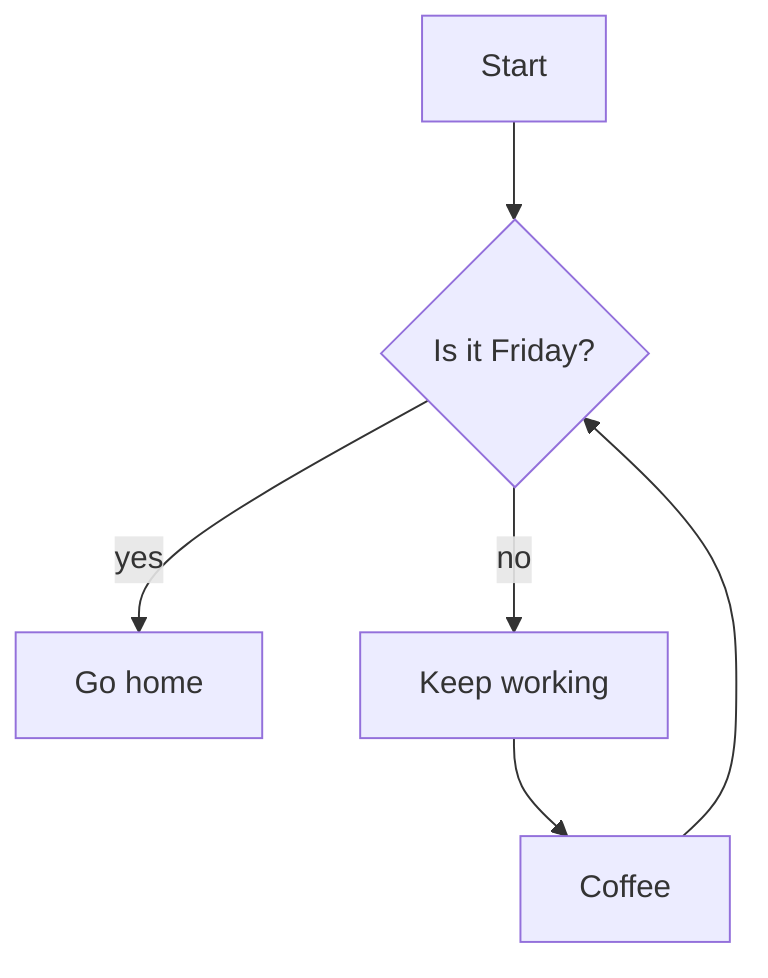
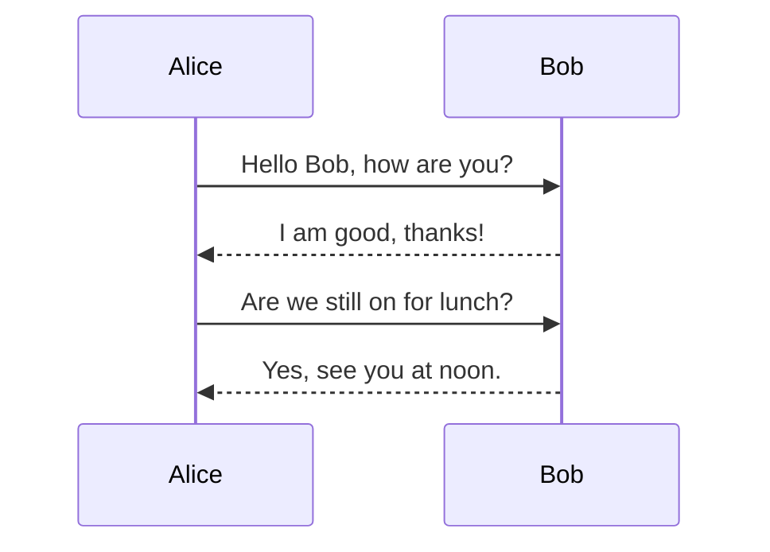

# Sample vault

This is a tiny vault you can use to verify the viewer renders everything
correctly. Open the `MD-Viewer` folder, then point the viewer at this
`sample-vault/` subfolder.

## Headings, emphasis, links

Some **bold** text, some *italic* text, some ~~strikethrough~~, some
`inline code`, an [external link](https://example.com), and a wiki-link
to [[Math notes]]. There's also an aliased wiki-link:
[[subfolder/Architecture|the architecture page]].

## Lists

Bullets:

- Item one
- Item two
  - Nested item
  - Another nested item
- Item three

Ordered:

1. First
2. Second
3. Third

Task list:

- [x] Write the parser
- [x] Add Mermaid sandbox
- [x] Verify offline rendering
- [ ] Open your own vault

## Table

| Column | Centered | Right-aligned |
|--------|:--------:|--------------:|
| foo    |    1     |           100 |
| bar    |    22    |          2000 |
| baz    |   333    |         30000 |

## Code block

```
function hello(name) {
  return "Hello, " + name;
}
```

## Callouts

> [!note] Heads up
> Callouts are blocks rendered with a colored stripe down the left edge.

> [!tip]
> A tip without a custom title falls back to the type name.

> [!warning] Be careful
> Warnings get an orange stripe.

> [!danger] Don't do this
> Red stripe for the dangerous stuff.

## Math

Inline: $E = mc^2$, fractions like $\frac{a}{b}$, Greek $\alpha + \beta$,
and roots like $\sqrt{x^2 + y^2}$.

Block:

$$
\sum_{i=1}^{n} i = \frac{n(n+1)}{2}
$$

## Mermaid: flowchart



## Mermaid: sequence



## See also

- [[Math notes]]
- [[subfolder/Architecture]]
- [[Callouts and quotes]]
