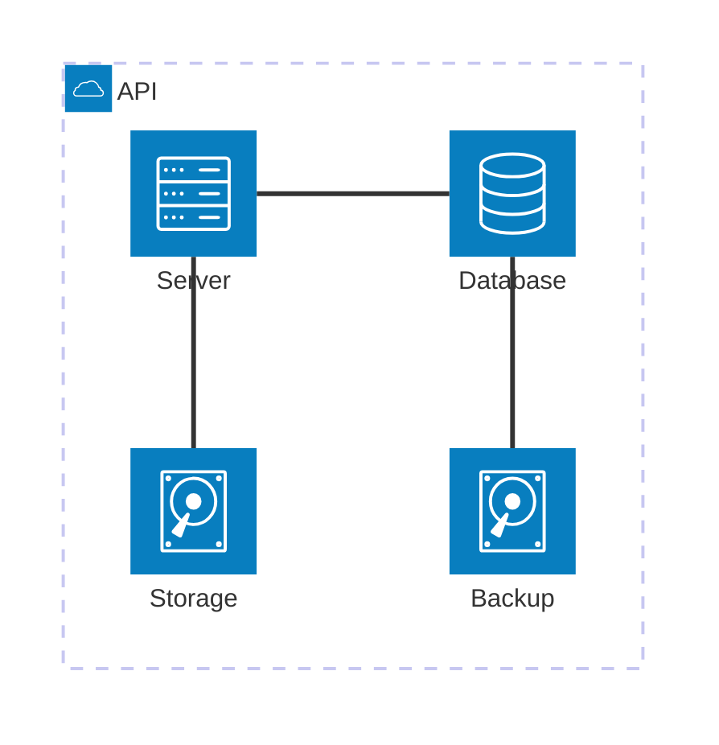

# Architecture

A page exercising the `architecture-beta` Mermaid diagram type.

## Notes

- The viewer's sandbox **allows** `architecture-beta` because we listed
  it explicitly. Other diagram types (gantt, mindmap, class…) get an
  error message instead.
- The mermaid runtime renders into a sandboxed iframe with no network
  access. Even if the upstream library had a fresh XSS, your other
  notes would not be reachable.
- This page also tests that wiki-links into folders work. Try the
  link back to [[../Math notes]] (relative-style) or
  [[subfolder/Architecture]] (absolute-from-root) from the README.
